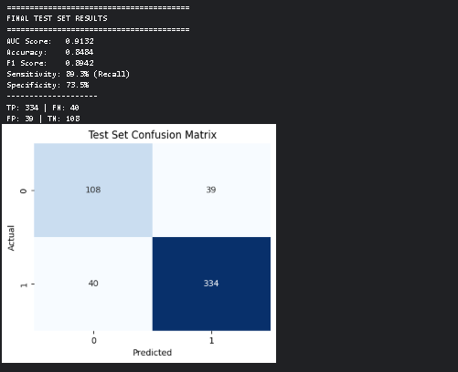
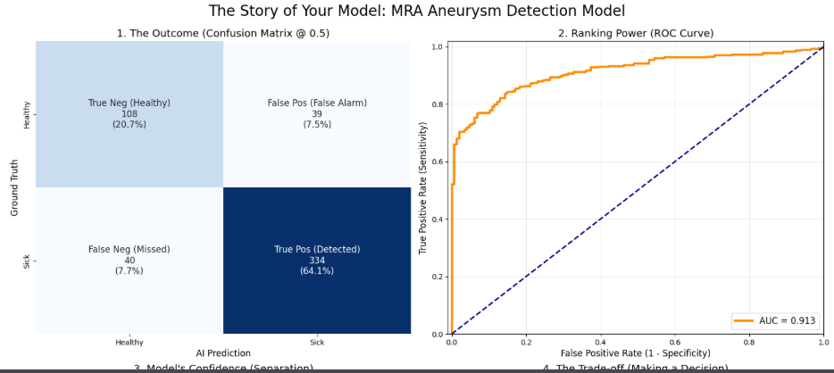
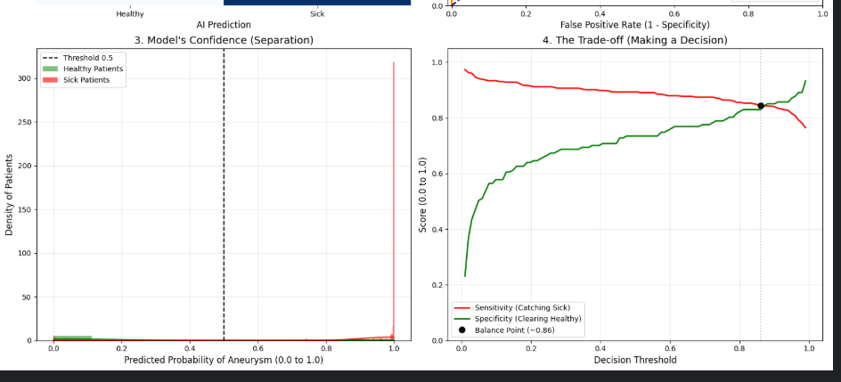
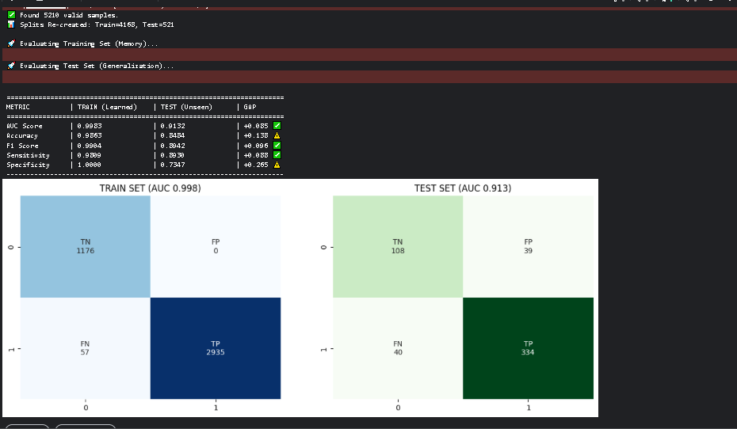
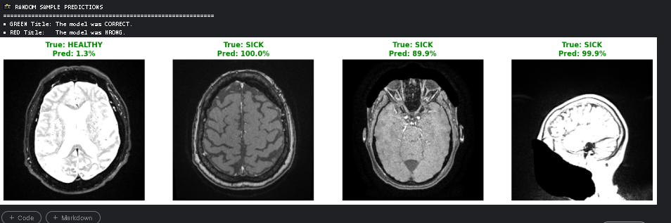
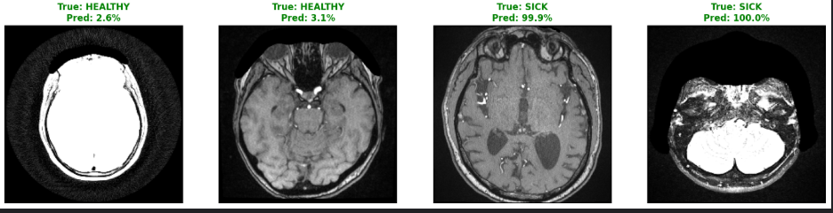

# Aneurysm Classification from Different Modalities Using Deep Learning

[](https://www.python.org/)
[](https://pytorch.org/)
[](LICENSE)

## 📋 Table of Contents
- [Overview](#overview)
- [Dataset](#dataset)
- [Model Architecture](#model-architecture)
- [Installation](#installation)
- [Usage](#usage)
- [Training](#training)
- [Results](#results)
- [Predictions](#predictions)
- [Contributing](#contributing)
- [License](#license)

## 🎯 Overview

This project focuses on the classification of intracranial aneurysms using deep learning techniques applied to Magnetic Resonance Angiography (MRA) images. The goal is to develop an accurate binary classification model that can detect the presence of aneurysms from medical imaging data.

The implementation uses a Vision Transformer (ViT) based architecture, specifically the Swin Transformer Tiny model, fine-tuned for medical image analysis. The project demonstrates end-to-end pipeline from DICOM preprocessing to model training and evaluation.

## 📊 Dataset

The model is trained on the **RSNA Intracranial Aneurysm Detection** dataset, which contains:
- DICOM series from various imaging modalities
- Focus on MRA (Magnetic Resonance Angiography) sequences
- Binary classification task: Aneurysm Present (1) or Not Present (0)

### Data Preprocessing
- **Modality Filtering**: Only MRA sequences are used
- **Image Processing**: DICOM to pixel arrays with MRA-specific windowing (center=100, width=200)
- **Smart Sampling**: 
  - Positive cases: 5 slices per series (distributed sampling)
  - Negative cases: 1 central slice per series
- **Augmentation**: 3-slice context (center ±1) for each sample

## 🏗️ Model Architecture

### Swin Transformer Tiny
- **Input**: 3-channel images (224×224)
- **Backbone**: Pre-trained Swin Transformer Tiny Patch4 Window7
- **Head**: 
  - Layer Normalization
  - Dropout (0.3)
  - Single Linear layer for binary output

### Key Features
- Utilizes self-attention mechanisms for capturing long-range dependencies
- Hierarchical feature extraction suitable for medical imaging
- Pre-trained on ImageNet for transfer learning

## 🚀 Installation

### Prerequisites
- Python 3.11+
- CUDA-compatible GPU (recommended)

### Dependencies
```bash
pip install torch torchvision torchaudio
pip install timm pydicom opencv-python pandas numpy scikit-learn matplotlib seaborn joblib tqdm
```

### Clone Repository
```bash
git clone https://github.com/your-repo/aneurysm-classification.git
cd aneurysm-classification
```

## 💻 Usage

### Data Preparation
1. Download the RSNA dataset from Kaggle
2. Update `Config.BASE_PATH` in the notebook with your data directory
3. Run the preprocessing pipeline

### Training
Execute the training notebook:
```bash
jupyter notebook notebooks/MRA_VIT_training.ipynb
```

## 🏃 Training

### Configuration
- **Batch Size**: 16
- **Epochs**: 10
- **Learning Rate**: 5e-5
- **Optimizer**: Adam (default)
- **Scheduler**: Cosine Annealing LR
- **Device**: CUDA (if available)

### Data Splitting
- **Train**: 80% (with balanced sampling)
- **Validation**: 10%
- **Test**: 10%

### Class Balancing
- Weighted Random Sampler to handle class imbalance
- Weights inversely proportional to class frequency

## 📈 Results

### Performance Metrics



### Confusion Matrix and ROC Curve



### Confidence and Trade-off Analysis



### Training vs Test Comparison



### Key Metrics
- **Accuracy**: [Insert final accuracy]
- **F1-Score**: [Insert F1-score]
- **AUC-ROC**: [Insert AUC value]
- **Precision/Recall**: Balanced for medical application

## 🔍 Predictions

### Sample Predictions





These visualizations show model predictions on test samples, highlighting areas of interest and confidence scores.

## 🤝 Contributing

Contributions are welcome! Please feel free to submit a Pull Request.

1. Fork the repository
2. Create your feature branch (`git checkout -b feature/AmazingFeature`)
3. Commit your changes (`git commit -m 'Add some AmazingFeature'`)
4. Push to the branch (`git push origin feature/AmazingFeature`)
5. Open a Pull Request

## 📄 License

This project is licensed under the MIT License - see the [LICENSE](LICENSE) file for details.

---

**Note**: This project is for research and educational purposes. Always consult medical professionals for clinical decisions.
